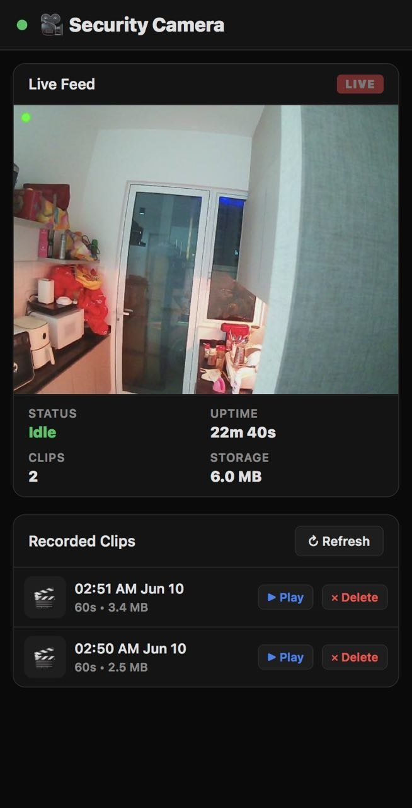

# UnitV2-M12 Security Camera

M5Stack UnitV2-M12 (SKU: U078-M12) security camera with motion detection, video recording, push alerts, and web dashboard.



> 🤖 **Developed with [OpenClaw](https://github.com/openclaw/openclaw)** — an AI agent platform for building, deploying, and managing projects on edge devices.

## Architecture

```
UnitV2-M12 (camera)                Server (Pi 4 / any Linux)
┌──────────────────┐               ┌──────────────────────────┐
│ GC2053 Camera    │               │ Dashboard Server :3006   │
│       ↓          │               │       ↕                  │
│ OpenCV + MOG2   │──── WiFi ────→│ Proxy to UnitV2          │
│ Motion Detection │  LAN / WiFi   │                          │
│       ↓          │               │ Optional:                │
│ MJPEG :8080      │               │  Cloudflare Tunnel       │
│ AVI → SD Card    │               │   → your.domain.com      │
│ ntfy.sh alerts   │               └──────────────────────────┘
└──────────────────┘
```

## Features

- **Motion detection** via background subtraction (MOG2) — lightweight, 128MB RAM friendly
- **Auto-recording** 60s AVI clips when motion detected, 30s cooldown after last motion
- **MJPEG live stream** with overlay (🔴 recording / 🟡 motion / 🟢 idle)
- **ntfy.sh push alerts** with 1.5s delayed JPEG snapshots (catches the person, not the trigger frame)
- **Auto-cleanup** of old clips when storage exceeds threshold
- **Web dashboard** with live feed, status, clip browser & playback
- **H.264 transcoding** (Pi 4) for Safari/iOS playback
- **HTTP Basic Auth** protecting all dashboard endpoints
- **3 deployment modes** (see below)
- **Auto-start** on boot

## Deployment Modes

### Mode 1: Public Domain (Cloudflare Tunnel) 🌐

Expose the dashboard on the internet via a domain, protected by HTTPS + Basic Auth.

```
Internet → Cloudflare Tunnel → Pi 4:3006 → UnitV2
```

**Setup:**
1. Create a Cloudflare tunnel pointing your domain to `localhost:3006`
2. Set auth credentials (required!):
   ```bash
   export CAM_DASH_USER=your_username
   export CAM_DASH_PASS=your_strong_password
   ```
3. Start the dashboard — anyone with credentials can access from anywhere

### Mode 2: Private IP / LAN Only 🏠

Dashboard is only accessible from your local network. No tunnel, no domain needed.

```
LAN devices → Pi 4:3006 → UnitV2
```

**Setup:**
1. Set auth credentials:
   ```bash
   export CAM_DASH_USER=your_username
   export CAM_DASH_PASS=your_password
   export CAM_DASH_HOST=0.0.0.0  # accessible from LAN
   ```
2. Start the dashboard — only local network devices can reach it

### Mode 3: Localhost Only 🔒

Most restrictive — only accessible from the Pi itself. Useful for testing or if you SSH tunnel in.

```
SSH tunnel → localhost:3006 → UnitV2
```

**Setup:**
1. Set:
   ```bash
   export CAM_DASH_USER=your_username
   export CAM_DASH_PASS=your_password
   export CAM_DASH_HOST=127.0.0.1
   ```
2. Access via `http://localhost:3006` on the Pi, or SSH tunnel:
   ```bash
   ssh -L 3006:localhost:3006 user@pi-ip
   ```

## Quick Start

### Prerequisites

**UnitV2:**
- Python 3.8+, OpenCV (`cv2`)
- SD card (MBR + FAT32) mounted at `/mnt/sdcard`
- `sshpass` on the server for clip management

**Server (Pi 4 / Linux):**
- Python 3.7+
- `ffmpeg` (for H.264 transcoding)
- `sshpass` (for SSH clip access to UnitV2)
- Optional: `cloudflared` (for tunnel)

### Install

```bash
# Clone
git clone https://github.com/yehchiam/unitv2-security-camera.git
cd unitv2-security-camera

# Copy and edit config
cp .env.example .env
# Edit .env with your credentials and UnitV2 IP

# Install dependencies (Pi 4)
sudo apt install ffmpeg sshpass

# Start dashboard (Pi 4)
source .env && python3 dashboard_server.py

# Start camera (UnitV2)
python3 security_cam.py
```

### Systemd Services

**Dashboard (Pi 4):** `camera-dashboard.service`
```ini
[Unit]
Description=Camera Dashboard (UnitV2 Proxy)
After=network.target

[Service]
ExecStart=/usr/bin/python3 /path/to/dashboard_server.py
EnvironmentFile=/path/to/.env
Restart=always
RestartSec=5

[Install]
WantedBy=multi-user.target
```

**Camera (UnitV2):** `/etc/init.d/S90securitycam`

### Environment Variables

| Variable | Default | Description |
|---|---|---|
| `CAM_DASH_USER` | `admin` | Dashboard login username |
| `CAM_DASH_PASS` | `changeme` | Dashboard login password (**change this!**) |
| `CAM_DASH_HOST` | `0.0.0.0` | Bind address (`0.0.0.0` for LAN, `127.0.0.1` for localhost) |
| `CAM_DASH_PORT` | `3006` | Dashboard port |
| `UNITV2_HOST` | `192.168.100.134` | UnitV2 IP address |
| `UNITV2_PORT` | `8080` | UnitV2 HTTP port |
| `UNITV2_SSH_USER` | `root` | UnitV2 SSH username |
| `UNITV2_SSH_PASS` | *(required)* | UnitV2 SSH password |
| `NTFY_URL` | `https://ntfy.sh/camera-aac2619e80df` | ntfy.sh push notification topic |

## Files

| File | Runs on | Description |
|---|---|---|
| `security_cam.py` | UnitV2 | Camera script — motion detection, recording, streaming |
| `dashboard_server.py` | Pi 4 | Web dashboard + proxy + transcoding + Basic Auth |
| `dashboard/index.html` | Browser | Dashboard UI |
| `.env.example` | Pi 4 | Template for environment variables |

## Camera Configuration

In `security_cam.py`:

| Setting | Default | Description |
|---|---|---|
| `CLIP_LENGTH` | 60 | Seconds per clip |
| `COOLDOWN` | 30 | Seconds after motion stops before recording ends |
| `FPS` | 10 | Recording frame rate |
| `RESIZE_W/H` | 320×240 | Recording resolution |
| `DETECT_W/H` | 160×120 | Detection resolution (smaller = faster) |
| `DETECT_SKIP` | 3 | Process every Nth frame for detection |
| `MIN_CONTOUR_AREA` | 800 | Min pixel area for motion detection |
| `MOTION_THRESHOLD` | 30 | Pixel diff threshold (higher = less sensitive) |
| `JPEG_QUALITY` | 50 | Stream JPEG quality (lower = less CPU) |
| `MAX_STORAGE_MB` | 110000 | Storage limit before auto-cleanup |
| `STREAM_PORT` | 8080 | MJPEG stream port |
| `STREAM_FPS` | 3 | Stream FPS (lower = less CPU/bandwidth) |
| `SNAPSHOT_DELAY` | 1.5s | Delay before snapshot grab (catches person, not trigger) |

## Security Notes

- **Always set `CAM_DASH_USER` and `CAM_DASH_PASS`** — default credentials are insecure
- `/stream` endpoint is public (no auth) — required for `` and `<video>` tags in browser
- All other endpoints (clips, status, delete) require authentication
- Video playback uses `fetch()` + Blob URL to pass auth credentials (browsers can't send Basic Auth from `<video>` tags)
- Passwords are compared using SHA-256 hashes (constant-time comparison)
- For public access, use HTTPS via Cloudflare Tunnel or a reverse proxy
- The UnitV2 SSH password is stored in `.env` (not committed to git)

## Notes

- UnitV2 SD card must use **MBR partition table** (not GPT) and **FAT32** filesystem
- FAT32 corruption causes kernel to mount SD read-only — auto-detect and remount rw built in
- M5Stack stock web UI (port 80) is disabled; security cam replaces it
- The UnitV2 Python has SSL cert issues — ntfy uses `ssl.CERT_NONE` workaround
- Recording uses MJPEG codec at 320×240 for low RAM usage (~25KB/frame)
- Estimated storage: ~1.5MB per 60s clip, ~110,000 clips on 119GB card
- Pi 4 transcodes AVI → MP4 on-the-fly for Safari/iOS playback
- CPU temperature monitoring included (SSD202D runs 70–77°C normally)
- ntfy push alerts have 60s cooldown, 1.5s snapshot delay, and 10MB min RAM check
- Snapshot thumbnails: 160×120 JPEG, ~3KB — minimal CPU/RAM impact

## License

MIT